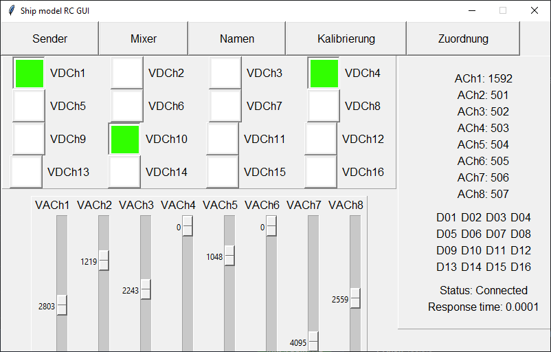
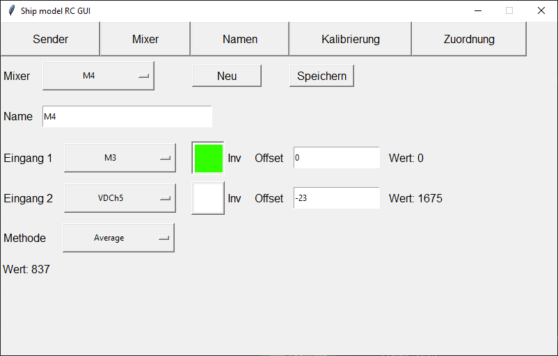
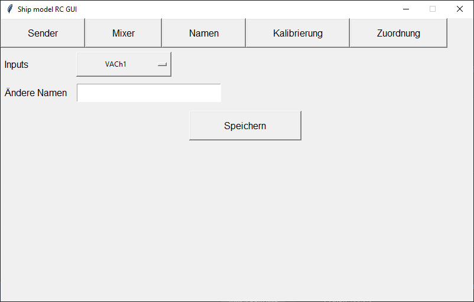
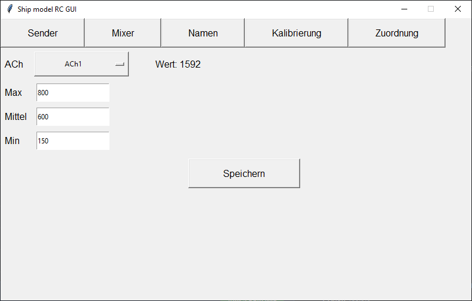
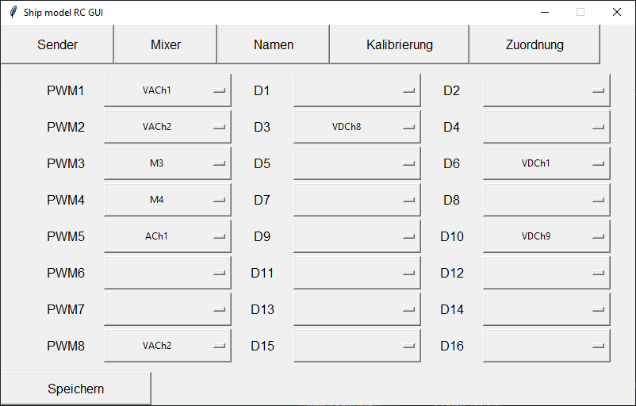

# Ship-model-RC-GUI
A small python project using the Tkinter GUI framework. This GUI can be used to remote control a ship model by running the receiver.py on, for example, a raspberry pi.
The GUI is started by running transmitty.py after a successful connection has been established.

